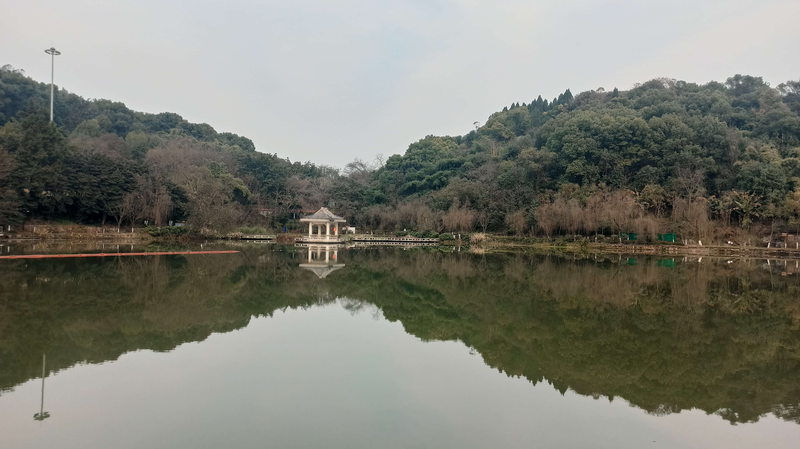
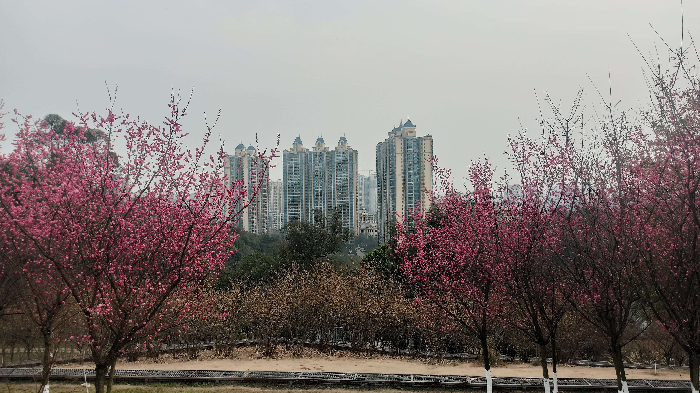
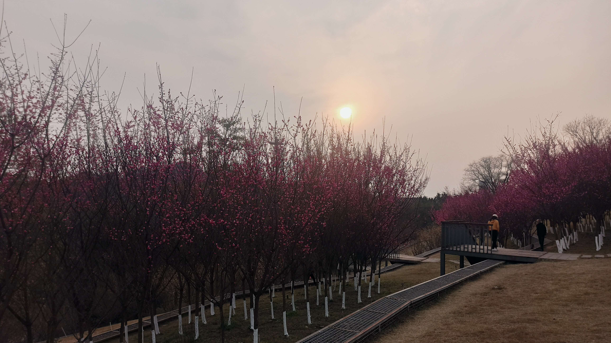
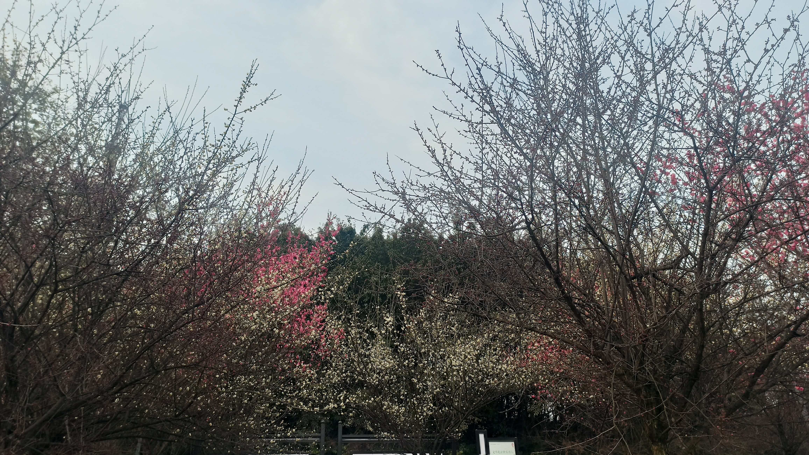
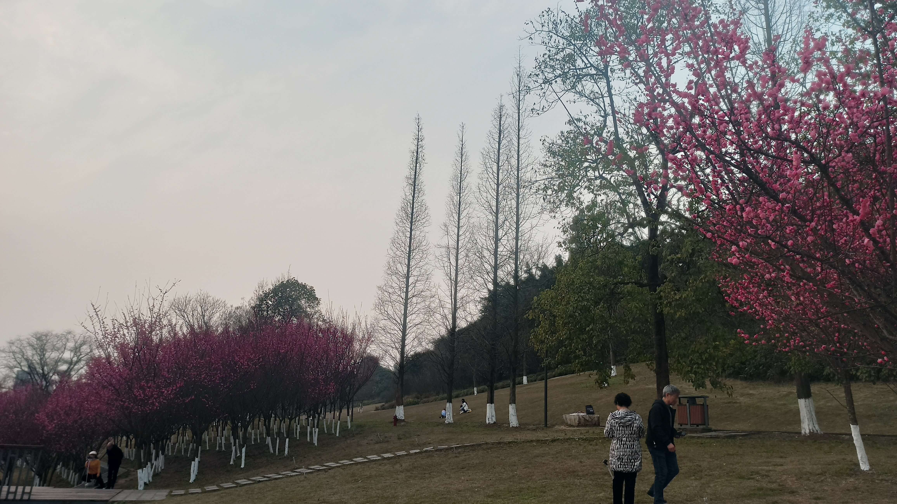
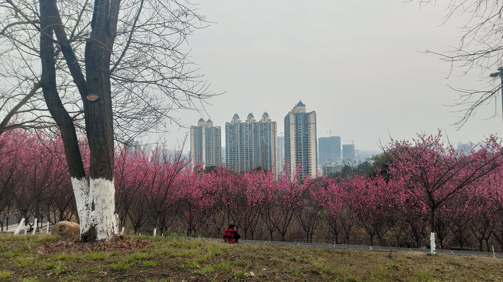
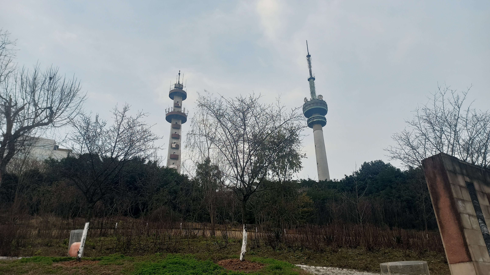
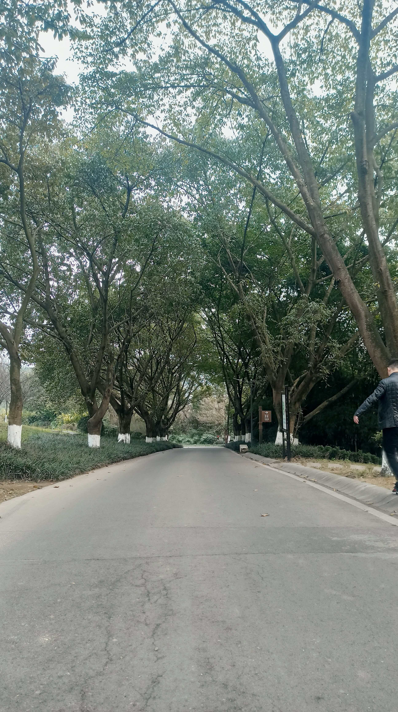
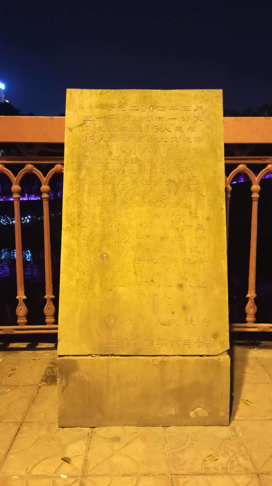

I had a trip with my 2 friends on 2021-02-07, in my hometown Zigong, Sichuan, China.
One of our destinations was Nanshan Botanical Garden, which was Xishan Park previously.
We took a walk around it and also took many satisfying photos.

## Lake and pavilion

## Flowers and trees

## Down road

## Monument

## Release and license

The photos are licensed under CC BY-NC-SA 4.0.
You can get the raw photos on [OneDrive][zigong-2021-02-07@OneDrive].

[zigong-2021-02-07@OneDrive]: https://myl7-my.sharepoint.com/:f:/g/personal/myl_myl7_onmicrosoft_com/Ei2g3p9cOnhLjkRYckwupRkBsJfITY4EJSA681jF71WSNQ?e=oO1UlM
